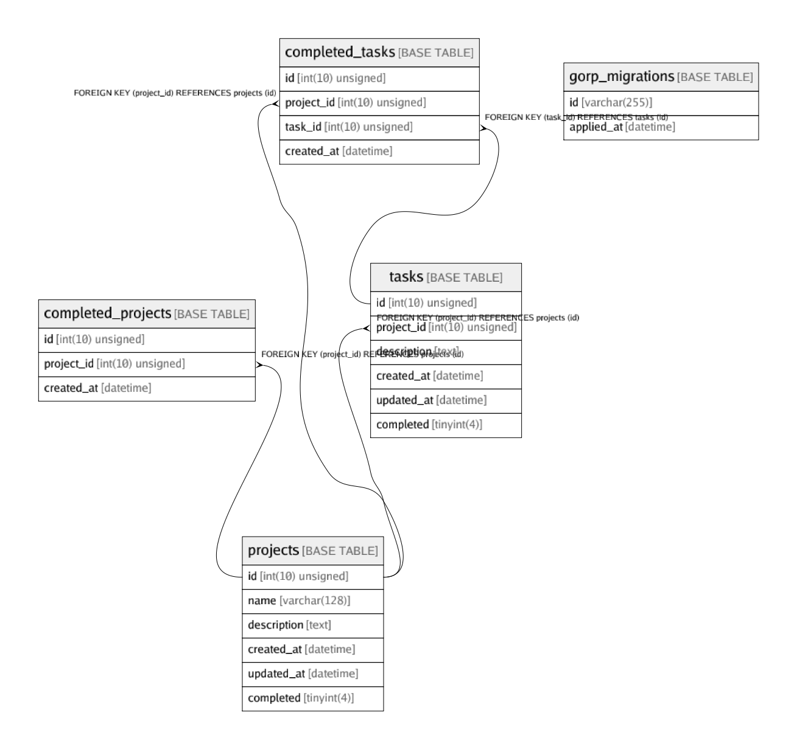

# sn_project_management

## Tables

| Name | Columns | Comment | Type |
| ---- | ------- | ------- | ---- |
| [completed_projects](completed_projects.md) | 3 |  | BASE TABLE |
| [completed_tasks](completed_tasks.md) | 4 |  | BASE TABLE |
| [gorp_migrations](gorp_migrations.md) | 2 |  | BASE TABLE |
| [projects](projects.md) | 6 |  | BASE TABLE |
| [tasks](tasks.md) | 6 |  | BASE TABLE |

## Relations

---

> Generated by [tbls](https://github.com/k1LoW/tbls)
