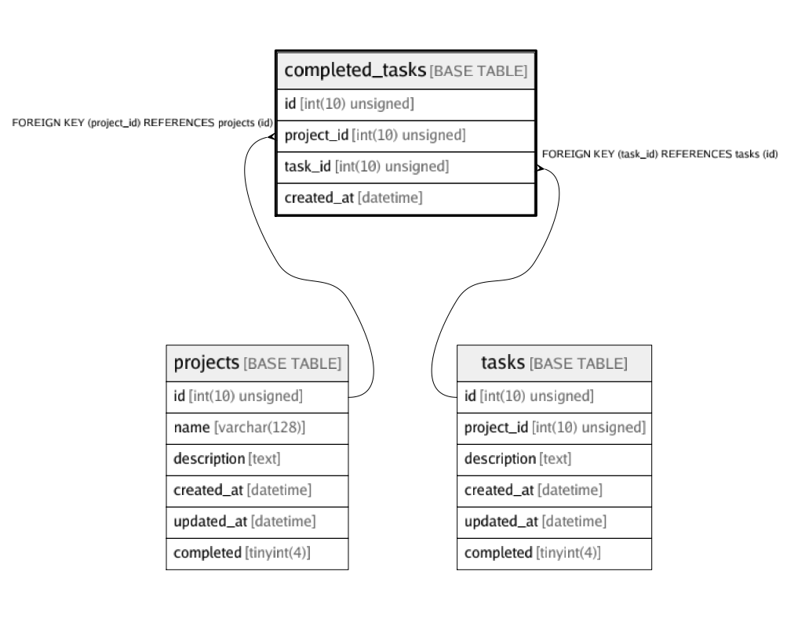

# completed_tasks

## Description

<details>
<summary><strong>Table Definition</strong></summary>

```sql
CREATE TABLE `completed_tasks` (
  `id` int(10) unsigned NOT NULL AUTO_INCREMENT,
  `project_id` int(10) unsigned NOT NULL,
  `task_id` int(10) unsigned NOT NULL,
  `created_at` datetime NOT NULL,
  PRIMARY KEY (`id`),
  KEY `fk_completed_tasks_projects` (`project_id`),
  KEY `fk_completed_tasks_tasks` (`task_id`),
  CONSTRAINT `fk_completed_tasks_projects` FOREIGN KEY (`project_id`) REFERENCES `projects` (`id`),
  CONSTRAINT `fk_completed_tasks_tasks` FOREIGN KEY (`task_id`) REFERENCES `tasks` (`id`)
) ENGINE=InnoDB DEFAULT CHARSET=utf8mb4 COLLATE=utf8mb4_bin
```

</details>

## Columns

| Name | Type | Default | Nullable | Children | Parents | Comment |
| ---- | ---- | ------- | -------- | -------- | ------- | ------- |
| id | int(10) unsigned |  | false |  |  |  |
| project_id | int(10) unsigned |  | false |  | [projects](projects.md) |  |
| task_id | int(10) unsigned |  | false |  | [tasks](tasks.md) |  |
| created_at | datetime |  | false |  |  |  |

## Constraints

| Name | Type | Definition |
| ---- | ---- | ---------- |
| fk_completed_tasks_projects | FOREIGN KEY | FOREIGN KEY (project_id) REFERENCES projects (id) |
| fk_completed_tasks_tasks | FOREIGN KEY | FOREIGN KEY (task_id) REFERENCES tasks (id) |
| PRIMARY | PRIMARY KEY | PRIMARY KEY (id) |

## Indexes

| Name | Definition |
| ---- | ---------- |
| fk_completed_tasks_projects | KEY fk_completed_tasks_projects (project_id) USING BTREE |
| fk_completed_tasks_tasks | KEY fk_completed_tasks_tasks (task_id) USING BTREE |
| PRIMARY | PRIMARY KEY (id) USING BTREE |

## Relations



---

> Generated by [tbls](https://github.com/k1LoW/tbls)
