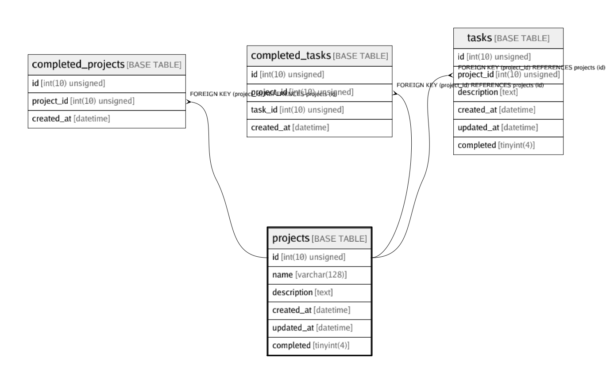

# projects

## Description

<details>
<summary><strong>Table Definition</strong></summary>

```sql
CREATE TABLE `projects` (
  `id` int(10) unsigned NOT NULL AUTO_INCREMENT,
  `name` varchar(128) COLLATE utf8mb4_bin NOT NULL,
  `description` text COLLATE utf8mb4_bin,
  `created_at` datetime NOT NULL,
  `updated_at` datetime NOT NULL,
  `completed` tinyint(4) NOT NULL DEFAULT '0',
  PRIMARY KEY (`id`)
) ENGINE=InnoDB AUTO_INCREMENT=15 DEFAULT CHARSET=utf8mb4 COLLATE=utf8mb4_bin
```

</details>

## Columns

| Name | Type | Default | Nullable | Children | Parents | Comment |
| ---- | ---- | ------- | -------- | -------- | ------- | ------- |
| id | int(10) unsigned |  | false | [completed_projects](completed_projects.md) [completed_tasks](completed_tasks.md) [tasks](tasks.md) |  |  |
| name | varchar(128) |  | false |  |  |  |
| description | text |  | true |  |  |  |
| created_at | datetime |  | false |  |  |  |
| updated_at | datetime |  | false |  |  |  |
| completed | tinyint(4) | 0 | false |  |  |  |

## Constraints

| Name | Type | Definition |
| ---- | ---- | ---------- |
| PRIMARY | PRIMARY KEY | PRIMARY KEY (id) |

## Indexes

| Name | Definition |
| ---- | ---------- |
| PRIMARY | PRIMARY KEY (id) USING BTREE |

## Relations



---

> Generated by [tbls](https://github.com/k1LoW/tbls)
